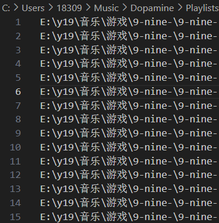

# m3u_match_edit
#### 使用版本：Python 3.11.5

## 问题背景
.m3u存储一系列歌曲路径作为歌曲列表如下：  
  
当其中的文件夹名称更改后，该列表会因无法自动更新而失效：  
  
本脚本通过匹配歌曲在m3u文件中存储的路径与实际文件夹中的路径，实现m3u文件的自动更新。

## 基本假设
### 1. **歌曲的名称没有被更改**  
  
  * 本脚本根据歌曲文件名作为匹配的关键字，因此本脚本的正常运行依赖于歌曲的文件名没有被更改这一基本假设。不符合此假设会导致功能无法实现。  
  * 对于歌曲名称被更改的情况，可以调用`ReportSongNotFound.py`寻找因名称被更改无法匹配到的歌曲。

### 2. **在音乐库中的音乐文件，不存在重名情况**  
  
  * 在不符合此假设的情况下，脚本会有**错匹配**与**漏匹配**的情况发生。  
  * 对于极少量的重名歌曲，可以将其加入`setting.json`的黑名单中，随后进行人工处理。  
  * `SearchSong.py`脚本可以帮助定位黑名单歌曲在音乐库与m3u文件中的位置，便于人工处理。

## 程序说明
### setting.json
    * 程序初次运行生成此文件，其中包含了需要配置的：
      * 音乐库路径
      * m3u文件存储目录
      * 黑名单开关
      * 黑名单

### 黑名单  
* 以`sample.mp3`的形式存储黑名单歌曲
* 在开启黑名单的情况下，程序生成的树状目录中仍然包含黑名单歌曲，但在匹配时不会对黑名单歌曲匹配。  

### LoadFileTree.py
* 扫描音乐库路径，生成包含全部歌曲的树状目录，以`file_tree.json`文件存储。  
* 扫描m3u文件目录，有m3u中的歌曲路径生成另一个树状目录，以`file_tree_m3u.json`文件存储。  
* 以歌曲名为关键词匹配两个树状目录，生成新旧路径的映射规则，以`map.json`文件存储。  
* `map.json`文件可在更新脚本运行前自行查看更改 **（尤其在音乐文件有重名的情况下重名歌曲会百分百出现匹配错误）**

### M3Uedit.py
* 根据`map.json`文件，自动m3u文件中的路径更新

### SearchSong.py  
* 在m3u文件目录与音乐库路径下扫描`setting.json`中记录的黑名单歌曲，生成报告`report_search_song.json`  

### ReportSameSong.py
* 寻找音乐库路径下全部同名歌曲，生成报告`report_same_song.json`

### ReportSongNotFound.py  
* 针对歌曲文件名被更改的情况，在音乐库路径下扫描m3u给出的歌曲名称，报告不存在的歌曲，生成报告`report_not_found.json`  
* **此功能只会报告m3u文件中存在但被更名的歌曲名称**，对于不在m3u文件中的歌曲，其更名无需处理

   

